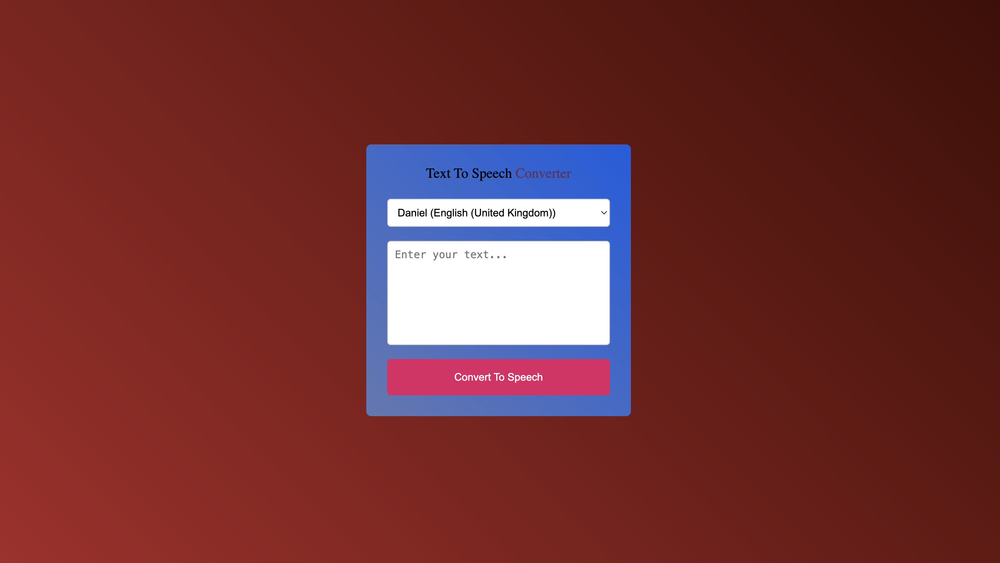
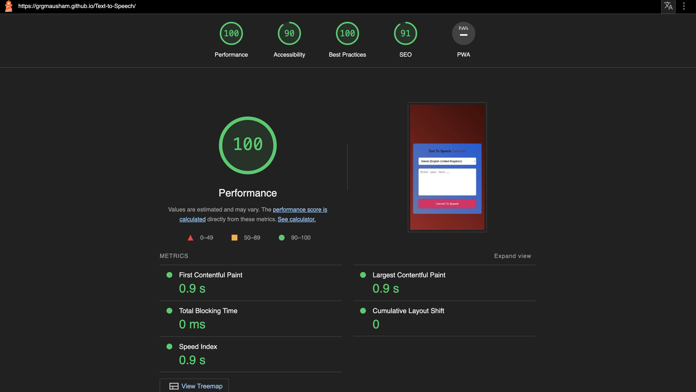

Welcome to [Text to Speech Converter!](https://grgmausham.github.io/Text-to-Speech/)!

This app has been designed to help convert the texts in form of speech.

Within this app, you can select the voices you like to hear and convert the written text into speech

### Technologies used
HTML5, CSS, JavaScript

## CONTENTS
* [Code Structure](#code-structure)
    - Assets Folder
    - Readme File
    - Html file

* [Design](#design)
    - Colour Scheme
    - Background Colours
    - Button Colours

* [Features](#features)
    - Dropdown menu
    - Textarea
    - Convert to speech button

* [Testing](#testing)
    - Validator Testing
        - [HTML Validator](https://validator.w3.org/). No errors found.
        - [CSS validator](https://jigsaw.w3.org/css-validator/). No errors found.
        - [JSHint](https://jshint.com/). 13 Warining.
    
    - Lighthouse Testing
    [lighthouse](assets/images/lighthouse.png)
    - Unfixed Bugs

* [Deployment](https://grgmausham.github.io/Text-to-Speech/)

* [Credits](#credits)
 - Youtube tutorial & idea [Greatstack](https://www.youtube.com/watch?v=3oDNqHZ7UKY)

#### Visitor Goals
- A place to write text of any legths and convert it into peferable voice speech.

## Design
### Colour Scheme
I decided to use red linear gredient colours for background as they are not too bright which helps user to write texts without getting distracted and could help keep the user engaged. Throughout the whole app there are different shades of blue and red.

#### Colours used:
- color1: linear-gradient(45deg, #a82626, #410b05)
- color2: linear-gradient(45deg, #6178b3, #055de0)

## Features
 - This app has ony 1 views of home page.
 - Dropdown select menu button to select the peferable voices.
 - Convert to speech button to convert the texts to speech.
### Landing Page

The landing page is an easy to use page. Minimal information keeping it clear for the user to navigate.

### Lighthouse testing
    - Lighthouse Testing, the following shows the results from lighthouse testing the home page.

### Bugs
- For mobile devices the app uses the default system voice.

### Unfixed Bugs
As of yet, I have not found any further bugs which still need fixing.

## Deployment & Local Development

### Deployment

The site is deployed using GitHub Pages - [Text to speech converter](https://grgmausham.github.io/Text-to-Speech/).
